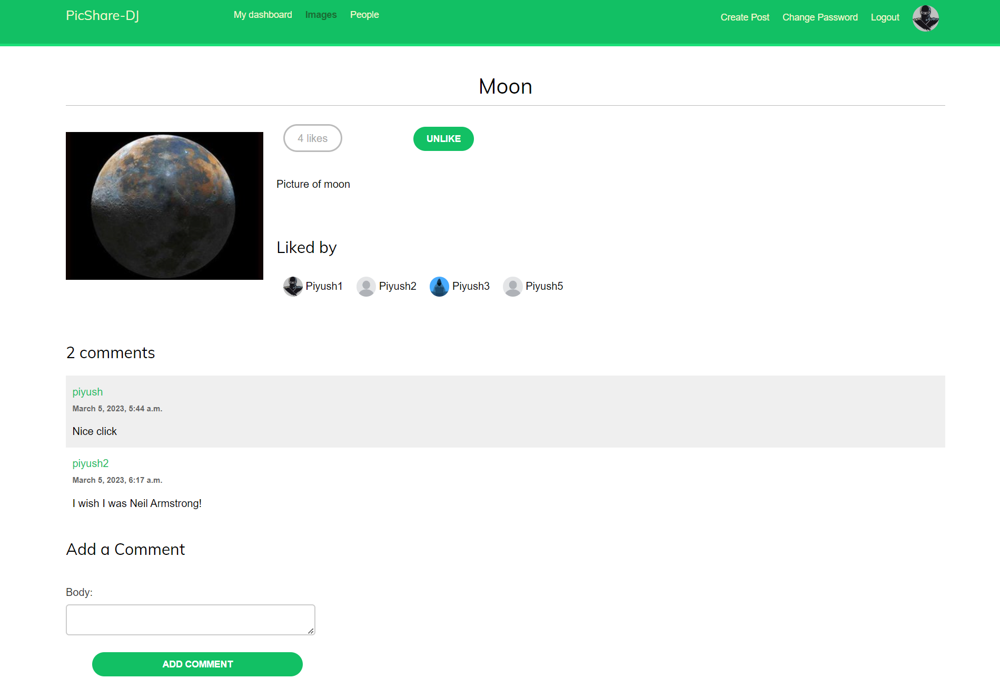

# PicShare-DJ

Picshare is a image sharing web application consisting of a complete login/registration system, password change and reset, user profile, and ability to share images directly from other websites, developed using `Python 3.8`, `Django 4.1`.

### Video Demo

### Features

- User authentication and registration
- Login via email or username
- Login with Facebook or Google account
- Password change
- Password reset using email
- Change profile picture
- Follow/unfollow users
- Share images from your pc
- Share images directly from any other website using bookmarklet
- Like/unlike posts

### Run on your local machine

###### Prerequisite: Python 3.8+

#### 1. Create a virtual environment

```bash
python -m venv <name>
. <name>/Scripts/activate
```

#### 2. Clone this repository and install requirements

```bash
$ git clone https://github.com/py-piyush/picshare-social-media-django.git
$ cd picshare-social-media-django
$ pip install -r requirements.txt
```

#### 3. Setup Facebook and Google authentication

> If you don't want to use social authentication, skip to step 6

- Locate hosts file in your pc and add following line to it

```
127.0.0.1 mypchost.com
```

- [Setup Facebook authentication]()
- [Setup Google authentication]()

#### 4. Configure environment variables

```
Create .env file in same directory as settings.py
Add facebook and google auth keys

# Facebook auth keys
SOCIAL_AUTH_FACEBOOK_KEY="XXX"
SOCIAL_AUTH_FACEBOOK_SECRET="XXX"

# Google auth keys
SOCIAL_AUTH_GOOGLE_OAUTH2_SECRET="XXX"
SOCIAL_AUTH_GOOGLE_OAUTH2_KEY="XXX"

```

#### 5. Run server

Go to directory where `manage.py` exists, and run following command

```bash
$ python manage.py runserver_plus --cert-file --cert.crt
```

Go to `https://mypchost.com:8000/account`.
Your browser will show a security warning because you are using a self-generated certificate. Click on Advanced and continue to site

#### 6. Run server without social authentication using http

```bash
$ python manage.py runserver
```

Go to `http://localhost:8000/account`

### Demo Pictures

- Registration Page
  
- Login Page
  
- User dashboard
  
- Create post form
  
- All posts
  
- Post detail
  
- All users
  
- User detail
  
