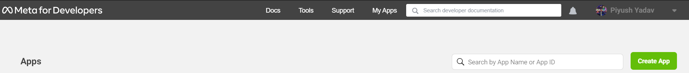
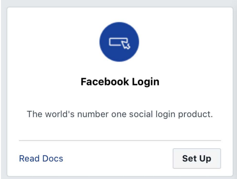
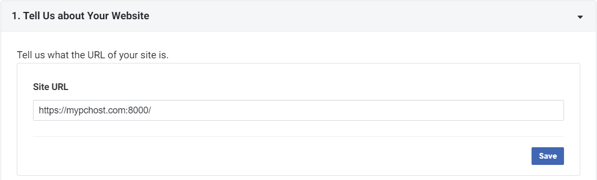
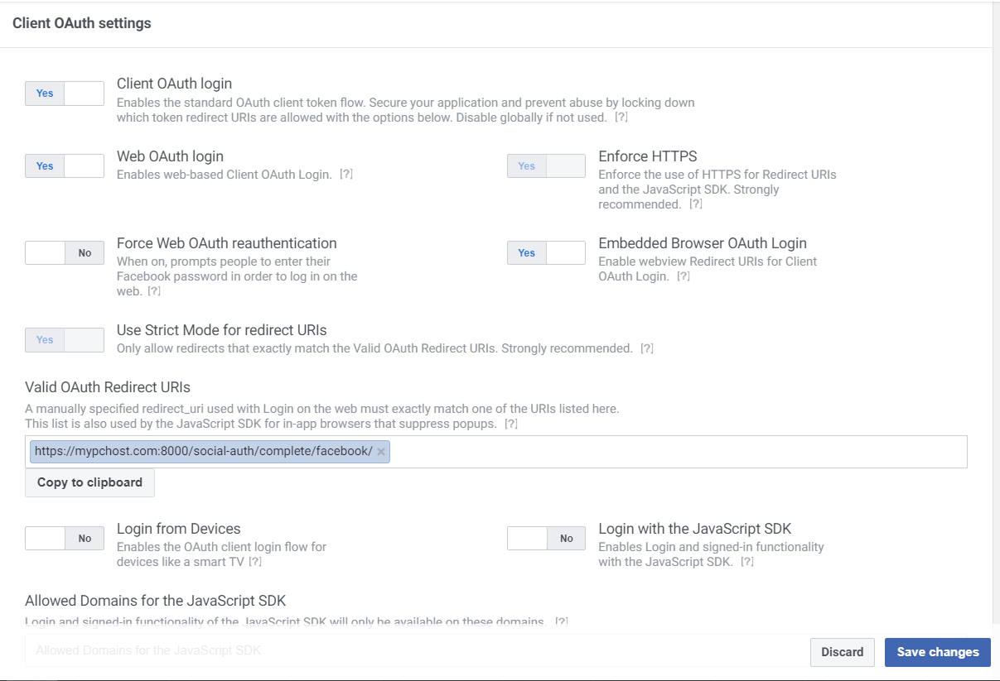

# Facebook login in Django

> All the external apps and settings have been configured.
> This file shows steps to obtain your own facebook app_id and app_secret.

1. Go to https://developers.facebook.com/ and create account.
2. Click on `My Apps` then `Create App`

   

3. Under `Select an app type`, choose `Consumer`.
4. Fill in the details and click `Create app`
5. Look for following box and click `Set up`, then choose `Web`.

   

6. Under `Site URL` enter `https://mypchost.com:8000`. Click `Save`, then `Continue`. You can skip the rest of part.

   

7. In the left-hand menu, click on `Settings` then `Basic`. You will get `App ID` and `App Secret`. Save them in a .env file (step 4)
8. Add `mypchost.com` under `App Domain`. Click on `Save changes`
9. In the left-hand menu, under `Products`, click on `Facebook Login -> Settings`.
10. Match the following, and click on save changes.

    
