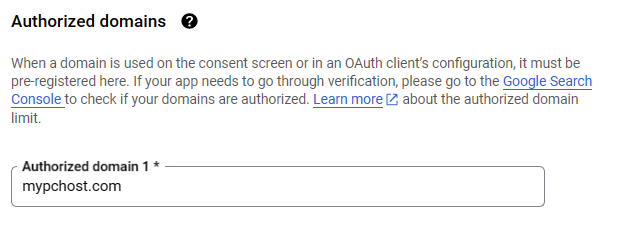
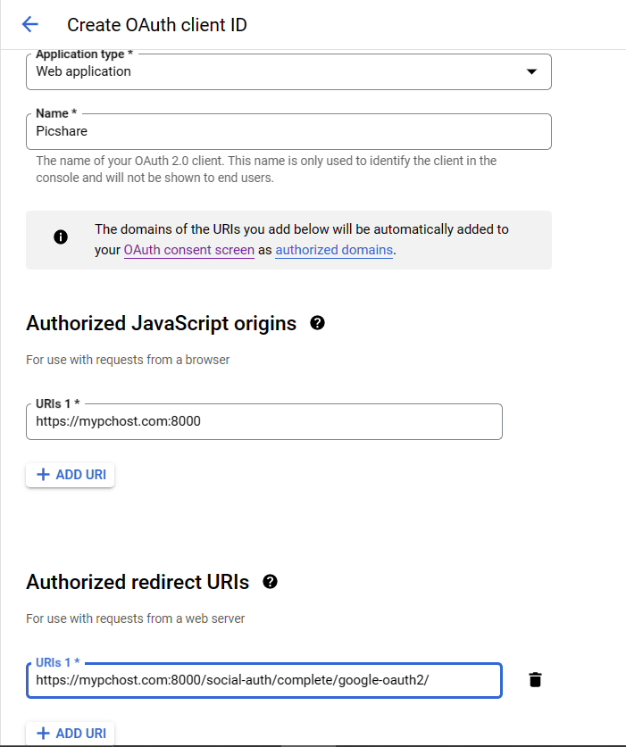

# Google login in Django

> All the external apps and settings have been configured.
> This file shows steps to obtain your own google app_key and app_secret.

1. Go to https://console.cloud.google.com/projectcreate
2. Fill in the `Project name` and click `CREATE`.
3. Under `Getting Started` in left-hand menu, click on `Explore and enable APIs`. Then click on `Credentials`.
4. Then click on `Create Credentials -> OAuth Client Id`
5. Select `External` under `User Type`, then click `Create`.
6. Fill in the `App name` and `User support email`.
7. Under `Authorised Domains`, enter mypchost.com.
   
8. Click `Save and Continue` in steps 2 and 3. Then click `Back to Dashboard`.
9. In the menu on the left sidebar, click on `Credentials` and click again on `Create credentials -> OAuth Client Id`.
10. Select `Web application` under Application type.
11. Match the following and click `Create`.
    
12. You will see a dialog box, copy the `Client ID` and `Client Secret`, and add them in .env file (step 4).
